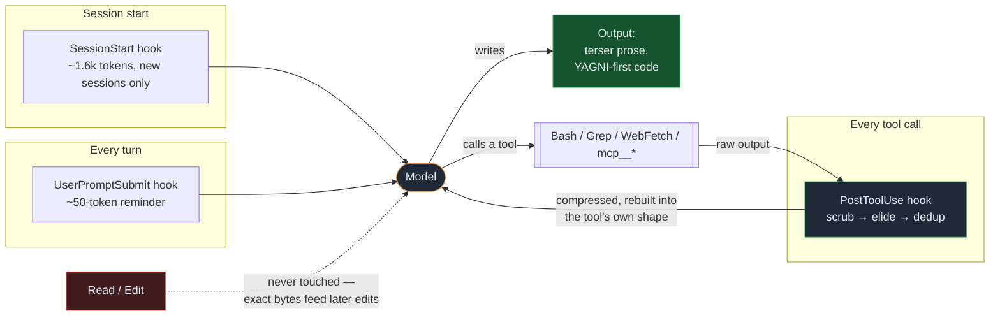
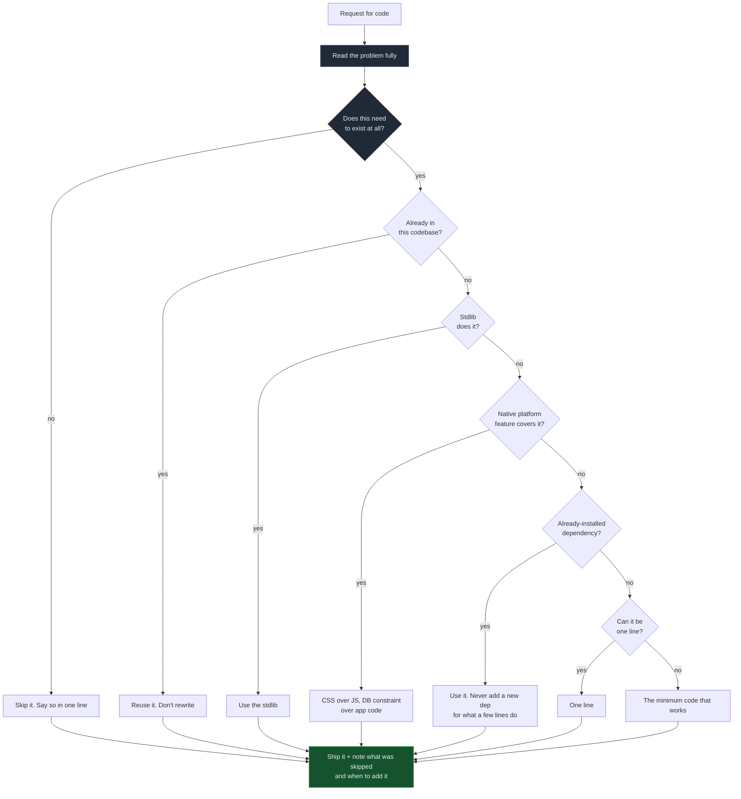

<p align="center">
  
</p>

<h1 align="center">Chisle</h1>

<p align="center">
  <em>Your AI talks less, builds less, reads less — and says more. Like a senior dev who bills by the syllable.</em>
</p>

<p align="center">
  <em>The only tool in this class that publishes the runs where it lost.</em>
</p>

<p align="center">
  <a href="https://www.npmjs.com/package/chisle"></a>
  
  <a href="https://github.com/JayPokale/Chisle/actions/workflows/test.yml"></a>
  
  
  <a href="https://github.com/JayPokale/Chisle/stargazers"></a>
</p>

<p align="center">
  <strong>44% of a bare model on coding work &middot; 41% on the long ones &middot; one command</strong>
</p>

<p align="center">
  <a href="https://chisle.jaypokale.me"><strong>chisle.jaypokale.me</strong></a> — the site version of this README, with fewer words
</p>

---

"Add debounce to a search input that currently fires an API call on every keystroke." Same model, same prompt, one difference — the injected ruleset. Both answers below are the **verbatim committed output** from [`benchmarks/results/raw/`](benchmarks/results/raw/):

<table>
<tr><th align="left" width="50%">bare agent — 142 lines, 1506 tokens</th><th align="left" width="50%">Chisle — 35 lines, 602 tokens</th></tr>
<tr valign="top"><td>

Opens with *"Let me show you the most common approaches"*, then ships a reusable generic `useDebounce<T>` hook in its own file…

```typescript
// useDebounce.ts
export function useDebounce<T>(
  value: T, delay: number
): T {
  const [debouncedValue, setDebouncedValue]
    = useState<T>(value);
  useEffect(() => { /* … */ }, [value, delay]);
  return debouncedValue;
}
```

…then **Option 2** and **Option 3**, a comparison table, and a caveats section.

</td><td>

Asks which framework, then answers the question that was actually asked — `setTimeout` in the effect you already have, no new file, no generic:

```jsx
useEffect(() => {
  const timer = setTimeout(async () => {
    if (query.trim()) { /* fetch */ }
  }, 300);
  return () => clearTimeout(timer);
}, [query]);
```

Then two lines on why it works, and *"use `lodash.debounce` if already installed."*

</td></tr>
</table>

Not golfed — **boring**. Same behaviour, one less abstraction, no second file, and it names the dependency you might already have instead of reinventing it.

Most efficiency tools compress one thing. Chisle compresses **three**:

| axis | what | how |
|---|---|---|
| **Output: prose** | filler, hedging, manufactured structure | zero-fluff ruleset, injected per session |
| **Output: code** | speculative abstractions, unrequested boilerplate | YAGNI efficiency ladder |
| **Input: context** | oversized tool output flooding the window | `PostToolUse` hook — scrub, elide, dedup — plus prevention rules |

Where each one attaches to a session:



The loop on the right is the input axis: tool output is billed again on *every* later request in the session, so shrinking it once pays repeatedly. `Read` and `Edit` are deliberately outside it.

<p align="center">
  
</p>

Every "be concise" tool has a worst day — the day it makes the model write *more* than no tool at all. Across 20 measured tasks over two suites, the specialists had that day **6** and **8** times, blowing up to **424%** of the baseline. Chisle had it **once**, capped at 173% — and that one failure was root-caused, fixed in the ruleset, and re-validated live at 93%, with the whole investigation [committed to the repo](benchmarks/results/2026-07-07-verify-rerun.md). Think of it as downside insurance for your token bill: not always the single cheapest answer, always the smallest worst case — from the only tool in this class that publishes its own failures. [Why not caveman or ponytail? →](docs/comparison.md)

---

## Install

One command. Auto-detects your agents (Claude Code, Cursor, Windsurf, Cline, Kiro, Codex, Gemini, Copilot) and wires each one. `--uninstall` puts everything back.

```bash
npx chisle
```

```bash
# or via curl
curl -fsSL https://raw.githubusercontent.com/JayPokale/Chisle/main/install.sh | bash
```

```powershell
# Windows
irm https://raw.githubusercontent.com/JayPokale/Chisle/main/install.ps1 | iex
```

Preview first with `npx chisle --dry-run`, scope with `--only claude`, see everything with `npx chisle --help`. Remove with `npx chisle --uninstall`.

**Requirements:** Node ≥18 (installer / `npx`) · Claude Code for `/chisle` toggling and input-side compression — the always-on ruleset still ships to every other agent.

### Upgrading

Same command as installing — it is idempotent and overwrites the previous copy:

```bash
npx chisle              # npm / standalone install
claude plugin update chisle@chisle   # Claude Code plugin install
```

Chisle checks npm on session start and mentions it once when a **major** version
is out (cached 3 days, `CHISLE_UPDATE_CHECK=0` to silence). Minor and patch
releases stay quiet on purpose.

Upgrading to 3.0.0 from 2.x needs nothing: a `lite`/`full`/`ultra` value in
`CHISLE_DEFAULT_MODE` or `config.json` is no longer meaningful, falls through to
the default, and Chisle stays active. It says so once so the setting is not
ignored silently — replace it with `on`/`off` or delete it.

### Claude Code plugin (marketplace)

```bash
claude plugin marketplace add JayPokale/Chisle   # register the marketplace
claude plugin install chisle@chisle              # enable the plugin
```

### See what it would do, before it does it

```bash
npx chisle --dry-run    # prints every file it would touch, changes nothing
```

Want the savings measured on your own work rather than ours? Clone the repo and replay the compressor over your existing Claude Code transcripts — it reads them locally, writes nothing, and reports the tokens the input-side hook would have stripped:

```bash
git clone https://github.com/JayPokale/Chisle && cd Chisle
node benchmarks/replay-compress.js
```

---

## Numbers

Nothing here is estimated. Every figure below is recomputed from committed raw data; the 2026-07-07 [verification writeup](benchmarks/results/2026-07-07-verify-rerun.md) re-derived the old claims from scratch, re-ran the whole suite against the competitors' **installed plugins**, and retired the one claim that didn't survive.

### Output axis — vs caveman & ponytail, 20 live tasks

**59+ live model runs** across two suites (June 4-arm matrix on Haiku + Sonnet sweep; July re-verification run). Arms differ only in the injected system prompt. Billed output tokens vs the no-tool baseline:

| | total bill (all 20 tasks) | average task | worst case | backfires |
|---|--:|--:|--:|--:|
| caveman | 80% | 98% | **424%** | 6 / 20 |
| ponytail | 68% | 91% | 227% | 8 / 20 |
| **Chisle** | **52%** | **69%** | **173%** | **1 / 20** |

Chisle wins all four columns: it cut the total 20-task bill **nearly in half** while the specialists managed 20–32%, and it did so with the smallest worst day and a twentieth the backfire rate.

<p align="center">
  
</p>

The bar is the whole 20-task bill; the badge is each tool's worst single day. caveman's worst day cost **4.2×** a bare model; ponytail's — a tool whose entire job is writing less — **2.3×**. Chisle's worst day was 1.7×, it happened once, and the fix is measured and merged.

In the July run all 24 answers, every arm, **graded correct**: nobody here buys token savings with wrong answers.

#### Code vs. explanation

Across all 20 cells, split by what the prompt actually asks for:

| | n | caveman | ponytail | **Chisle** |
|---|--:|--:|--:|--:|
| **coding** (wants working code) | 12 | 74% | 59% | **44%** |
| **non-coding** (wants an explanation) | 8 | 103% | 104% | **87%** |

Code is where the YAGNI ladder has something to bite on: an abstraction to skip, a stdlib call to reach for, a file not to create. Chisle bills **44%** of a bare model there — a third less than ponytail, which is the closest thing to a dedicated lazy-code tool.

On explanation-only prompts the picture is worse for everyone. Both specialists land **above 100%** — a tool whose job is writing less made the model write *more* than using nothing at all. Chisle is the only arm that stays under water (87%), which is a smaller win than the coding number and worth saying plainly.

This does revise a claim the earlier Sonnet writeup made. On that suite's three prose prompts caveman was leaner (44% vs 52%), and that still holds *for those cells*. Pooled across all eight non-coding cells it does not: caveman is at 103%. The prose win was suite-specific, not general.

#### Task by task

Averages hide the interesting part, so here is every cell of the June suite — same six prompts, every arm, no cherry-picking:

<p align="center">
  
</p>

Chisle is leanest on **5 of 6**. caveman takes `cache` (8% vs our 12%) — it wins by answering in prose where we still emit working code, which is the trade you would want on a task that asked for code. Note the two prose rows where ponytail lands **above** 100%: a tool built to write less made the model write *more* than using no tool at all. That is the failure mode the worst-case column above is really about.

#### The headline average is hiding the good part

Split the same 20 cells at their median baseline — short answers below, long answers above — and the tools separate sharply:

<p align="center">
  
</p>

On **short** answers Chisle and caveman are level (84% each) — there is not much to cut in a three-line reply, and the ruleset overhead is proportionally at its worst. On **long** answers Chisle drops to **45%** while caveman only reaches 79%. The 52% headline is the blend of the two, so it understates the case where it matters and overstates the case where it doesn't.

The effect is not driven by one lucky cell. Dropping the `cache` outlier (the row where the baseline invented 150 lines against a codebase it never saw) *widens* the gap on long answers: caveman degrades to **116%** — worse than using no tool — while Chisle holds at **65%**.

Two honest limits. Per-task rank correlation between baseline size and leanness is weak (Spearman ρ = −0.15), so this is a difference between aggregate bills, not a tidy per-task law — with n=10 a side, treat it as a strong signal rather than a settled result. And much of the widening gap comes from the specialists getting *worse* on long answers, not only from Chisle getting better.

#### Size or kind? Both, and they're tangled

Coding prompts average ~1129 baseline tokens against ~393 for explanation prompts, so "long" and "code" largely describe the same cells. Crossing the two separates them as far as 20 tasks allow:

| | n | caveman | ponytail | **Chisle** |
|---|--:|--:|--:|--:|
| coding · short | 5 | **62%** | 116% | 70% |
| coding · long | 7 | 76% | 52% | **41%** |
| non-coding · short | 5 | 104% | 98% | **96%** |
| non-coding · long | 3 | 103% | 111% | **77%** |

<p align="center">
  
</p>

Size matters *within* each kind — coding goes 70% → 41%, non-coding 96% → 77% — so it isn't merely code in disguise. But the cells are thin, and the non-coding "long" bucket spans only 522–542 tokens, which is barely long at all.

The one row Chisle loses is **short coding**, where caveman takes it 62% to 70%. That is the honest shape of it: on a small code question there is little to skip, and the ruleset costs more than the ladder saves. The tool earns its keep on the long ones.

`SUITE=large` exists to fill the thin cells — see [below](#see-what-it-would-do-before-it-does-it).

These prompts were never designed to test this, which is the real caveat. To probe it directly:

```bash
SUITE=large bash benchmarks/run-live.sh <model> benchmarks/results/raw-large
```

#### Where each tool actually helps

|  | prose | code judgment | input/context | worst-case guard | publishes failures |
|---|:---:|:---:|:---:|:---:|:---:|
| caveman | ✅ | ❌ | ❌ | ❌ 424% | ❌ |
| ponytail | ❌ | ✅ | ❌ | ❌ 227% | ❌ |
| headroom | ❌ | ❌ | ✅ proxy | — | ❌ |
| **Chisle** | ✅ | ✅ | ✅ hook | **173%, 1/20** | ✅ |

The row that matters is the last one. Every tool here looks good on its best day; the numbers above are the only ones in this class published alongside the run that went wrong. [Full comparison →](docs/comparison.md)

### Input axis — tool-output compression (Claude Code)

Measured over 171 real sessions ([receipts](benchmarks/results/2026-07-07-input-axis.md)): tool output is **67.5%** of context content, and every byte of it is re-billed on *every subsequent request* in the session (median: 171 requests). A `PostToolUse` hook shrinks it before the model reads it — deterministic, zero LLM, zero network:

| tier | what it does | loss |
|---|---|---|
| **scrub** | strips ANSI escapes, collapses blank runs and `line repeated N×` | none |
| **elide** | oversized output → head + tail, error-like lines salvaged from the cut | bounded, guarded |
| **dedup** | byte-identical repeat of a tool's previous output (same session) → one-line marker | none — the copy is already in context |

Replayed over the same 171 sessions: **~61k tokens** saved one-shot, ~46% off every eligible output — floor, not estimate, since each saved byte also stops being re-sent on every later request. Correctness rules: allowlist only (`Bash`, `Agent`, `WebFetch`, `WebSearch`, `Grep`, `Glob`, `mcp__*`) — never `Read`/`Edit`, whose exact bytes feed later edits. Honest ledger: dedup scored **0 hits** on this corpus (rtk-filtered at source); it's kept for the test-rerun case, kill-switchable, and labeled speculative until it earns a number. Replay it on your own transcripts:

```bash
node benchmarks/replay-compress.js        # what it would have saved you
```

Outputs over 8k chars are elided. `stop chisle`, `CHISLE_COMPRESS=0`, `CHISLE_COMPRESS_SCRUB=0`, `CHISLE_COMPRESS_DEDUP=0` — every tier has an off switch.

### Prevention — the context diet

The biggest context whale (whole-file `Read`s — 5.6M chars in the measured corpus) can't be compressed without breaking later edits. So the ruleset attacks it upstream, in every agent: grep for the symbol first, read only the matching region, narrow at the source (`ls dir` not `ls -R`, pipe long output through `tail`/`grep`), never re-read what's already in context.

---

## What the output sounds like

**"Why does this React component re-render?"**
> New object ref each render. Inline object prop = new ref = re-render. `useMemo`.

**"Add a cache for API responses."**
> `@lru_cache(maxsize=1000)` on the fetch fn. Skipped a custom cache class — add one when `lru_cache` measurably falls short.

---

## Usage

| Command | Effect |
|---------|--------|
| *(nothing)* | On automatically every session after install |
| `/chisle` | Re-activate if you'd stopped it |
| `/chisle off` | Deactivate |
| `stop chisle` | Deactivate (ruleset *and* input-side compression) |
| `normal mode` | Deactivate |

Natural language works too: "activate chisle", "chisle mode", "chislify this". Code symbols, function/API names, and error strings stay verbatim — only the noise around them compresses.

---

## How it works

Before writing code, the agent stops at the first rung that holds:



The ladder runs **after** reading, never instead of it. Note the exit: every rung lands on the same obligation — say what you skipped, so "later" doesn't quietly become "never".

The ladder runs *after* reading the code — lazy about the solution, never about understanding. Lazy is not negligent: trust-boundary validation, data-loss handling, security, and accessibility are never on the chopping block.

Mark deliberate simplifications so "later" doesn't quietly become "never":

```js
// chisle: global lock, per-account locks if throughput matters
// chisle: O(n) scan, index this when table exceeds ~10k rows
```

---

## Config

**On by default.** After install, Chisle activates automatically every session — no `/chisle` needed. Set `off` to stay dormant until you type `/chisle`:

```bash
# env var (highest priority)
export CHISLE_DEFAULT_MODE=off

# config file (persists across shells)
~/.config/chisle/config.json → { "defaultMode": "off" }
```

Resolution: env var → config file → `on`. Valid: `off`, `on`.

---

## Prior art & what stacks with it

Chisle borrows the best published token-saving techniques and implements the ones that fit a zero-dep hook; the rest stack cleanly alongside it:

| technique | source | in Chisle? |
|---|---|---|
| Prose compression persona | [caveman](https://github.com/JuliusBrussee/caveman) | ✅ + code judgment it lacks |
| YAGNI/lazy-code ruleset | [ponytail](https://github.com/dietrichgebert/ponytail) | ✅ + prose discipline it lacks |
| Tool-output elision (head/tail) | [headroom](https://github.com/headroomlabs-ai/headroom)-style, proxy-free | ✅ hook, no proxy — works on subscription OAuth |
| ANSI strip / log crush / dedup | headroom transforms | ✅ scrub + dedup tiers |
| Command rewriting at the source | RTK-style `PreToolUse` ([writeup](https://andrewpatterson.dev/posts/token-savings-rtk-headroom/)) | ❌ stacks — RTK shrinks at source, Chisle catches what it can't reach (subagents, MCP, web) |
| MCP/codebase-graph indexing | context-mode, [token-optimizer-mcp](https://github.com/ooples/token-optimizer-mcp) | ❌ stacks — orthogonal layer |
| CLAUDE.md dieting | [community guides](https://www.firecrawl.dev/blog/claude-code-token-efficiency) | ✅ `/chisle-audit` flags bloated docs/config prose |

## Multi-agent

Primarily a Claude Code plugin, but ships to every agent with a rules/context file — Cursor, Windsurf, Cline, Kiro, Codex, Gemini, Copilot. Per-agent copies generated by `scripts/build-rules.js` (a condensed mirror of the skill — edit both, CI checks sync). See [`docs/agent-portability.md`](./docs/agent-portability.md). Input-side compression is Claude Code-only for now: no other agent exposes a post-tool output rewrite hook.

## FAQ

**Doesn't injecting a persona every turn cost tokens?**
Yes — a ruleset at session start (~1.6k tokens) plus a ~50-token reminder per turn. Output is where it pays back: coding answers shrink 40–60% (benchmarks), and output bills several × higher than input.

Worth reading the dissent before you take that on faith: [@enc0ded](https://github.com/enc0ded) measured 173 of their own sessions ([#2](https://github.com/JayPokale/Chisle/issues/2)) and found the injection overhead roughly cancelling the compressor's savings — because the ruleset was being re-sent on every resume and clear, not just at startup. That re-injection is fixed, which removes most of the overhead they measured, but their wider point stands: prose is only ~25% of what the model emits, so the ceiling on the output axis is lower than the headline suggests, and on a one-line throwaway prompt the overhead still exceeds the saving.

**Will it golf my code into clever one-liners?**
No. Boring over clever. Deletion beats addition; obfuscation isn't deletion.

**Does it cut corners on safety?**
Never. Input validation, data-loss handling, security, and accessibility are off the table. Lazy about solutions, not about reading the problem.

**Can the output compressor eat a line I needed?**
Designed not to: allowlist keeps `Read`/`Edit` exact, error-looking lines are salvaged from any elided region, dedup only fires on byte-identical same-session repeats, and every tier has a kill switch. If it still bites you, file an issue — that's a bug, not the design.

**Should the star count worry me?**
Everyone starts at zero. Run `npx chisle --dry-run`, see what it'd do, decide. And if the receipts convinced you, [a star](https://github.com/JayPokale/Chisle/stargazers) is how the next person finds them — it's also the only payment a zero-dep MIT tool will ever ask for.

→ [More FAQ and competitor comparison](docs/comparison.md)

---

## Contributing

See [CONTRIBUTING.md](CONTRIBUTING.md). Edit the skill (`skills/chisle/SKILL.md`) **and** the condensed rule body in `scripts/build-rules.js`, regenerate copies and chart, run the tests. CI enforces all three.

Built by [Jay Pokale](https://github.com/JayPokale) with [Claude](https://claude.com/claude-code), [Antigravity](https://antigravity.google), and [Codex](https://openai.com/blog/openai-codex/) as co-engineers — the input-compression hook, the benchmark verification, and several of the bug hunts documented in the changelog were pair-work.

```bash
npm test    # 67 tests: flag safety, tracker, settings merge, installer, compressor
```

## License

[MIT](LICENSE). The shortest license that works.

## Contributors

<a href="https://github.com/JayPokale/Chisle/graphs/contributors">
  
</a>

**AI co-engineers** (pair-work credited in commit trailers and the changelog):

<p>
  <a href="https://claude.com/claude-code"></a>
  <a href="https://openai.com/codex/"></a>
  <a href="https://antigravity.google/"></a>
</p>

---

<p align="center">
  Saved you tokens? <a href="https://github.com/JayPokale/Chisle">⭐ Star the repo</a> — it costs zero tokens and keeps the benchmarks running.
</p>
